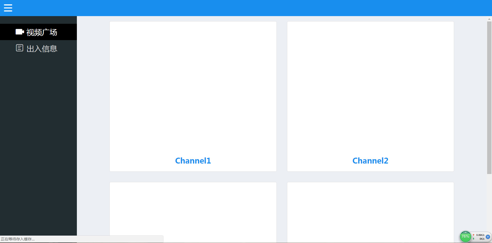

# 三天打造一款全栈简易视频直播网站（一）

***

——从前端谈项目架构、接口设计、前后端设计、node.js中间层封装、项目测试、性能优化以及运维部属


## 0.先备知识

在你跟着我的文章进行实战操作之前，你应当具备相关的开发知识，前端的H5、CSS3、ES6、git的基本使用还有node.js这些基本知识我就不多说了，如果不懂我还是希望你先别往后看，赶紧加快修炼吧，因为本项目大体都将使用ES6作开发。本项目属于前端进阶内容，不会介绍像Bootstrap，jQuery或者React等各类框架或者库的使用，前端部分全部都是原生手写，并且有大量拓展知识需要去了解，其中包括前端模块化、前后端分离、接口设计原则、node基本操作、koa2基本知识，PHP基本操作、MySQL基本操作、webpack3、项目测试（单元测试、自动化测试）、pm2负载均衡、nginx反向代理、xampp使用、Linux基本操作。如果作为读者的你在看完这套技术栈后有些迷茫，也没关系，在后面的文章中我会引入相关介绍链接，在哪个知识点上迷茫，多去推敲即可，祝成功！完整的项目我已经托管在了github上，欢迎大家来提出批评和意见，地址是：https://github.com/jerryOnlyZRJ/video-system

其中的代码可能比较简单，功能模块可能也比较单一，我希望和大家分享的是项目从规划到实现的整体思想，所以不要在意这些细节啦。。。

## 1.目录结构

```
├── build  网站上线目录
├── coverage  覆盖率测试结果
├── src  网站开发目录
├── tests  项目测试目录
├── .babelrc  babel配置文件
├── .gitignore  git有关
├── gulpfile.js  gulp配置文件
├── jest.config.js  jest配置文件
├── readme.md
├── package.json
├── webpack.config.js   webpack开发配置文件
└── webpack.production.config.js   webpack上线配置文件
```

## 2.需求分析

几天前我本在匆匆忙忙地准备各大公司的实习生招聘简历，实验室的一位好哥们忽然找到了我，他最近在研发一款基于机器学习的人脸识别监控系统，希望我能协助他完成前端的工作。正好之前我也有对视频直播作过一些研究，兄弟有难，对我来说这项任务当然是义不容辞的啦。从他手里我拿到两份供我使用的东西，一份是以`MIMETYPE:multipart/x-mixed-replace;boundary=frame`传输的视频流的URL，还有一份是存储识别结果的资源数据库，我需要做的，便是将视频流展示，将识别结果以表单形式展示。

### 2.1.视频直播实现

实现视频直播的方式有很多，包括之前我提及过得RTMP协议，还有本项目使用的MIMETYPE:multipart/x-mixed-replace;boundary=frame的HTTP传输方式，所有的方式思想都是一样，无非就是服务器实时推送，客户端实时拉取。对于本项目而言，因为在后台需要对视频流中的每一帧作识别处理，并且将识别结果以帧的形式导出，因此这里我们选择了后者。如果想深入了解这种传输方式，大家可以浏览这篇博文，里面对此做了详细介绍：https://www.cnblogs.com/leaven/p/3514650.html 其实它的本质，便是以数据块的形式传输视频帧，后一个数据块将会替代前一个数据块，boundary表示它传输的时间间隔，这里的值是frame（帧）。具体在网页中的应用就更为简单，我们只需要用一个img标签引入就行，将src设置为后台给予我们的URL即可，就像是引入一张图片。

### 2.2.数据库接口层封装

既然以及为我们提供了资源数据库，那么我们只需要再给后台加一层PHP即可。其实这部分工作原则来说应该是归属后端的，但是因为本项目只有我们两个人，哥们他在图像识别那边已经有很多工作了，加上我也有能力完成，所以我更需要接手这份工作。其实在实际的开发过程中，作为一名前端人员也应当多去了解一些后端开发的知识，一定是利大于弊的，别想着那不是我的工作范围我就不管不问了，当项目出BUG的时候，你就会知道知识的匮乏会让你多苦逼了。本项目的开发过程是完全前后端分离的，所以在开发过程中，我们不会用到上线服务器，所以我们得现在开发环境中搭建上线服务器的模拟环境，废话不多说，开始工作：

后端给我的数据库结构是下面这样的：

```
Field         Type
people_id     INT   (P)
name 		 VARCHAR(20)    自定义名字
age           INT
sex			 INT
pic_url		 VARCHAR(50)    首次在摄像头范围内识别到某人员的视频帧URL
video_url	 VARCHAR(50)	某人员在摄像头内出现时候的视频
last_time	 DATE		    某人员在摄像头中最后出现的时间
```

那么，我们先在本地的MySQL中建立一个名为`video`的数据库，并且在该数据库下建立一张名为`info`的数据表，具体SQL代码参考项目根目录下的`info.sql`文件，PHP接口层封装参考项目`build/info.php`文件，这里大家会好奇我为什么把PHP文件放在了一个名字叫`build`的文件夹里，大家先别着急，一会就会给大家讲解。这里需要特别提及一下，因为这是我在开发机上搭建的模拟服务器环境，所以在PHP里我就直接用root去链接了，还有最后的输出，我们通过`json_encode()`转化成了字符串，所以在前端接收数据时一定要记得`JSON.parse()`。

上面的事情做完了之后，我们的后端模拟工作就基本结束啦，接下来就要开始我们真正的前端工作了。

## 3.前端架构

这里我们的工作包括了前端界面实现和前端业务逻辑实现，作为学生党自己钻研的项目，最好不过的地方便是没有UI设计图纸，哈哈，那么我这么一位全身充满文艺气息的文艺青年就可以尽情挥洒才华啦！虽然说不太专业，但我觉得我的审美还算过得去。。。别取笑我！这里大家可能会问要不要用什么库啊像Bootstrap什么的，在这里我是强烈不推荐的，现在CSS3这么好用，很多样式完全可以我们自己写，还能展示我们自己的特色，甚至是jQuery，在本项目中都不使用，H5给我们提供了那么多好用的API，jQuery已经逐渐在退出历史舞台啦。而且因为项目只是为了搭建一个简易的直播网站，所以我也没用React这些框架，可以说，整个项目大体都是手写原生代码（除了node，那个用原生真的会写到肾亏）。

### 3.1.UI设计

给大家看看我设计的前端界面：



看起来是不是特别简约，要的就是这个效果。页面的顶端是一个导航栏，最开始我们只加入了一个`menu-btn`，click之后会跳出侧边导航栏，里面有两个`li`，用于切换右边的`content-box`里面的内容。“视频广场”对应的`content-box`内有四个`item`，用于展示我们的视频（后端实际上给了我四个视频流的URL），“出入信息”对应的content-box用于展示我们的数据库信息。整体的布局我使用的是`flex`，主要原因就是两个字——好用。其实本来想用`grid`的，但发现太久没用了生疏了，而且还有一些新特性还是在测试阶段（说白了就是笔者好多地方忘了怎么写了），随意最后毅然决然了选择了`flex`。之所以这样布局，一是符合现在流行的简约布局风格，最关键的是这样的布局方式更方便后期我们做响应式。PS：响应式的部分不在我们的三天内容内，以后如果有需要我会继续更新并深入介绍。

### 3.2.代码实现

有了UI设计方案，那我们就开始上手代码吧。先`$ npm init`初始化我们的项目，并在项目根目录下新建一个`build`（或者`dist`）目录用于存放我们的项目上线文件。新建一个`src`目录用于存放我们的项目开发文件，在`src`目录内新建一个`public`（或`static`）目录用于存放我们的静态资源，新建一个`views`目录用于存放我们的静态页面。`src`和`build`的关系便是：`src`目录下的源文件经过编译压缩等操作后将会生成到我们的build目录下，最后我们只需要将`build`内的文件复制到上线服务器上运行就可以了，也就是说，`build`文件内存放的才是我们最终的“产品”。

接下来我们在`src`目录内的`views`目录下新建一个`index.html`作为我们的静态首页并开始实现之前的UI设计，代码因为已经托管在了github上了，这里我就不作介绍了，大家争取自己尝试去复现一下项目，本项目的代码仅供参考。

PS：因为没用jQuery，所以为了实现AJAX，我没使用原生写法编写XMLHttpRequest，而是使用了新推出的 fetch API，虽然说这个API还在测试阶段，但是以Promise对象作为异步运用，能够大大解决JS早期因为异步回调产生的回调地狱，还有更好的可读性，有了ES6的相关知识后也很好上手，何乐而不为？这里给大家推荐一篇fetch API的介绍文：https://segmentfault.com/a/1190000011433064

### 3.3.webpack配置

#### 3.3.1.为什么要用webpack?

这里就涉及到了前端模块化和工程化的思想。众所周知，在前端工作中，如果我们要在页面内引入CSS样式或者JS文件，通常都是通过`link`或者`script`标签，但如果，当我们的项目越来越庞大，需要引入的文件越来越多的时候，那我们就得一直往html文件里添加标签，浪费人力不说，页面布满了`link`和`script`也不合适。作为前端开发的基本素养，这里我就视读者掌握了CommonJS，AMD，CMD以及ES6 Module的相关知识，在本文就不作提及，之后的代码我们都将以模块化的形式编写。

当然，做过开发的前端er们都知道，浏览器并不支持模块的导出和引入，要解决这一问题， 可以选择垫片(不推荐，知道有这么个东西就行)，当然，还可以使用我们的打包工具。webpack就是实现我们前端工作工程化的工具。有很多人说，打包工具有很多啊，gulp，grunt还有新出的parcel，为什么我们要选择webpack？暂时，你只要知道webpack更适合我们做views层的打包就行了，而且webpack将所有的东西都视为模块——万物皆模块，也就是说我们不论是引入JS还是引入CSS，都可以以模块的形式去做，至于几个打包工具的利弊，在后面我们用gulp对node层进行打包时，会再作深入分析。

因此我们先在项目的根目录下添加两个文件，一个是`webpack.config.js`（开发版），`webpack.production.config.js`(上线版)。开发版用于开发阶段我们的调试工作，上线版用于项目最后我们生成上线文件时的打包工作。其实两份文件的内容相差无几，唯一的区别便是：相比与开发版的webpack配置文件，我们会在上线版的配置文件中增加代码压缩等功能，以实现我们的资源最大性能优化。

如果大家在webpack遇到了什么困难，可以参考这篇文章：https://www.jianshu.com/p/42e11515c10f

#### 3.3.2.webpack中配置的注意事项

（一）这里为了区分ES6文件和编译后的普通JS文件，我将ES文件的后缀名设置为了`.es`的形式，所以在配置文档里。我们应当在`babel-loader`里的匹配项中加上`\.es`

（二）在output的属性中，我增加了`publicPath: '/'`一行，增加之后插入HTML文件中的`script`和`link`标签的`src`属性值的开头会增加一个‘/’字符，表示在根目录下的路径，目的是为了配合koa中的静态资源配置。如果你有CDN服务器，那就可以把publicPath填上你的CDN IP。

（三）我在编译后的JS文件和CSS文件的文件名中自动添加了MD5戳，目的是防止更新JS文件或者CSS文件之后网站不同步的情况。

（四）我使用了webpack自带的CommonsChunkPlugin插件（webpack4已对此做了修改，切记安装时应当`$ npm i webpack@3`否则会报错)，目的是提取打包后JS文件中的公共代码，因为每次我们引入一个模块（说白话就是require一次），webpack都会往打包后的文件添加这个模块里的代码，当项目的体积越来越大时，我们不免需要引入许多相同的模块，这样就会产生大量重复的代码，造成资源浪费，通过这一插件就能解决这一问题。

（五）在项目里我使用了`clean-webpack-plugin`这款插件，目的是清空前一次编译后的文件。因为我之前提到过，我在JS和CSS文件名后自动添加了MD5戳，由于不会出现重名冲突，所以前一次编译的文件不会被替换，每次编译后都会增加一份文件，这是我们所不想看到的。运用这款插件的目的就是清空`build`目录下的`pubilc`和`views`内的所有文件。

### 3.4.package.json深入

#### 3.4.1.快捷命令

项目的最后，大家可以打开根目录下的`package.json`文件，这里存放着我们项目的一些基本信息还有依赖文件，大家结合之前我们配置好的webpack，可以在文件中的`"scripts"`属性中加入以下两行代码:

`"dev": "webpack-dev-server --open"`

`"build": "set NODE_ENV=production && webpack --config ./webpack.production.config.js --progress"`

前一行代码的作用是在本地模拟一台测试服务器，能够展示你编译后的页面，并实时监听代码变化自动刷新页面，配置可以参考`webpack.config.js`文件内的`devServer`属性值。而第二行代码，是以`webpack.production.config.js`内的配置编译项目，加入了这两行代码之后，我们在编译上线文件的时候就不需要敲一长串Shell啦，直接`$ npm run build`就OK了。

####3.4.2.区分开发环境和上线环境

`package.json`的作用不仅仅局限于制定我们的快捷命令，大家翻到文件的下方，会看到这两个属性：`"devDependencies"`、`"dependencies"`,前者是指开发环境下的项目依赖，诸如我们的打包工具webpack和后面将提到的gulp，还有我们的测试插件jest和supertest，这些都会在后两天的项目任务中深入介绍，而后者是指上线环境下的项目依赖，诸如我们的koa还有一系列koa引申的插件。在node环境中，我们使用命令`$ npm i`将会自动安装所有的依赖，而使用`$ npm i -S`和`$ npm i -D`将会分别安装上线环境所需的依赖和开发环境所需的依赖，之所以这么区分的作用，我们将会在第三天的服务器上线任务中详细介绍，现在我们需要知道的是，在安装相关依赖时，你必须事先判断它是属于开发环境下的还是上线环境下的，并将他们区分开来，使用不同的安装命令。

## 4.结语

在编写好代码之后，试着`$ npm run build`并在`build`目录下找到你编译好的`index.html`文件，打开看看是不是你设计好的样式，还有正常执行的业务逻辑。如果出现了BUG，可以使用chrome的开发者工具打断点，或者在源代码中加上`debugger`关键字（这个关键字的效果就相当于我们平时在开发者工具里打的断点）。

第一天的任务基本就结束了，我们做了前端界面设计及实现，前端工程化的配置，很多东西都是很依靠灵感的，就像我们的界面设计，如果一时没有头绪，不用着急，喝杯咖啡听一首歌，让自己好好休息一下再继续。

其他也都剩一些基本知识了，就不需要过多提及了，如果项目中遇到了困难，记住多查文档多看社区，内事问百度，外事找谷歌，总会有解决方案的，解决BUG的过程虽然痛苦，但最后时刻的喜悦是难以形容的，加油！

最后来一句每日箴言：Done is better than perfect.