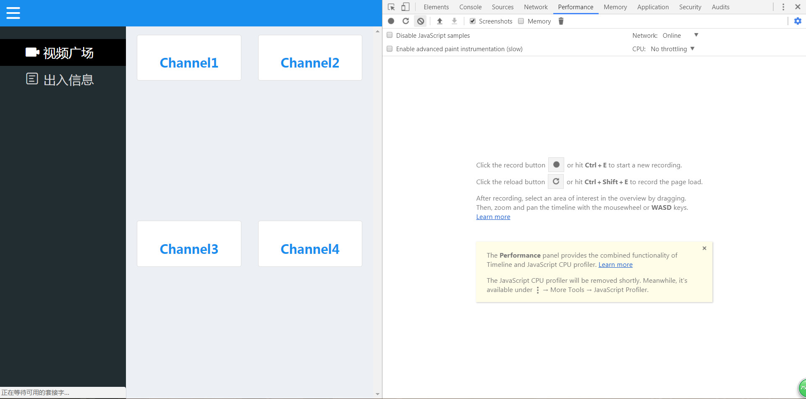
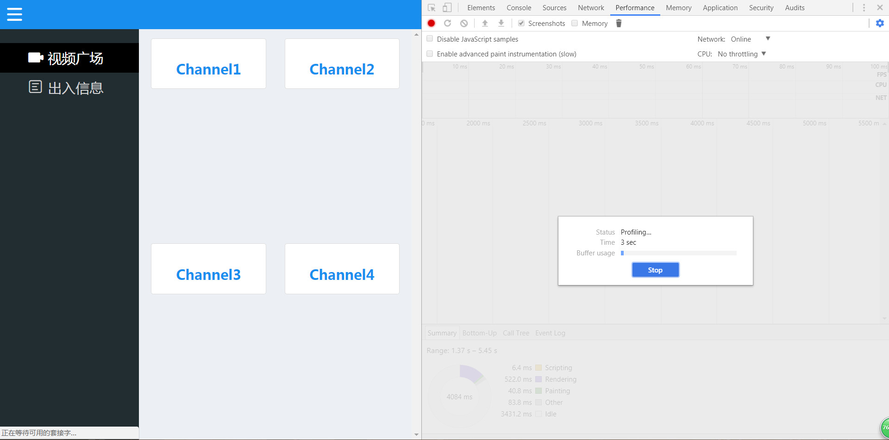

# 三天打造一款全栈简易视频直播网站（三）

------

——从前端谈项目架构、接口设计、前后端设计、node.js中间层封装、项目测试、性能优化以及运维部属


## 0.今日任务

在前两天的工作中，我们已经完成了前端界面实现、node层封装，基本上可以说，我们已经完成了一个完整的前端开发项目了，但是如果就这么结束了，那还绝对不够，虽然我们做了测试、也对BUG进行了调试，但是，在网页项目中，没有作过性能监测的代码注定是失败的，哪怕代码写的再好再美观再有条例，一个网页的首屏时间却高达十几秒，那还有什么意义呢？所以今天我们的重点之一，就是性能检测，不仅如此，我们还会讲一些团队开发的代码规范，最后我们还会提到运维的相关知识，包括上线服务器环境部属，这里可能会用到Linux的一些基本命令，大家最好提前先去了解了解。

完整的项目我已经托管在了github上，欢迎大家来提出批评和意见，地址是：https://github.com/jerryOnlyZRJ/video-system

## 1.nginx反向代理

### 1.1.反向代理基本概念

在开始我们今天的工作之前，献给大家引入一些项目必须具备的知识，最先提到的便是我们的反向代理。可能大家对这个名词比较陌生，先上一张图：


所谓代理就是我们通常所说的中介，网站的反向代理就是指那台介于用户和我们真实服务器之间的那台服务器（说的我都拗口了），它的作用便是能够将用户的请求分配到压力较小的服务器上，其机制是轮询，听起来是不是感觉很耳熟，没错，之前在第二天我们介绍pm2的时候也说过同样的话，反向代理起到的作用同pm2一样也是实现负载均衡，你现在应该也明白了两者之间的差异，反向代理是对服务器实现负载均衡，而pm2是对进程实现负载均衡。大家如果想深入了解反向代理的相关知识，我推荐知乎的一个贴子：https://www.zhihu.com/question/24723688 。但是大家会想到，配服务器是运维的事情啊，和我们前端有什么关系呢？的确，在这部分，我们的工作只有一些，只需要向运维提供一份配置文档即可。

### 1.1.反向代理配置信息

翻看本项目的源代码，你会在`build`目录下找到一个名为`nginx-conf`的目录，里面存放的便是我们需要提交给运维的nginx反向代理配置。这里大家会疑问为什么我们要用nginx作反向代理？我们的node难道不能实现这方面功能吗？说实话，node的闪光点便是异步IO和高并发，就反向代理这一功能来说，的的确确是它的软肋，而就nginx而言，就很适合作为反向代理的代理层。闲话不多说，上配置代码再深入介绍：

```
http {
	upstream video {
		ip_hash;
		server localhost:3000;
	}
	server {
		listen: 8080;
		location / {
			proxy_pass: http://video
		}
	}
}
```

也就是说，在和运维对接的时候，我们只需要将上面这几行代码改为我们配置好的文档发送给他就行了，其他的事情，运维小哥会明白的，不用多说，都在酒里。

但是，这几行代码该怎么去改呢？首先我们得知道，在nginx中，模块被分为三大类：handler、filter和upstream。而其中的upstream模块，负责完成完成网络数据的接收、处理和转发，也是我们需要在反向代理中用到的模块。接下来我们将介绍配置代码里的内容所表示的含义

####1.1.1.upstream配置信息：

upstream关键字后紧跟的标识符是我们自定义的项目名称，通过一对花括号在其中增添我们的配置信息。

`ip_hash`关键字：控制用户再次访问时是否连接到前一次连接的服务器

`server`关键字：我们真实服务器的地址，这里的内容肯定是需要我们去填写的，不然运维怎么知道你把项目放在那个目录上了，也不知道你封装了一层node而得去监听3000端口

####1.1.2.server配置信息

server是nginx的基本配置，我们需要通过server将我们定义的upstream应用到服务器上。

`listen`关键字：服务器监听的端口

`location`关键字：和我们之前在node层说到的路由是起同样的功能，这里是把用户的请求分配到对应的upstream上


本次项目由于没有充足的资源，身为学生党的我能在学校拿到一台服务器已经得来不易了，所以本项目就没对反向代理作相关工作了，但是作为前端进阶必须了解的知识，在实战中还是经常需要运用到的，提前了解没有坏处。

## 2.产品上线

前面所有的任务都完成了，那我们就可以将产品上线了，这里我用的是学校分配给我的服务器，大家也可以使用腾讯云等云服务，接下来，就要进入我们的命令行开启一段前端工程师没见过的新世界了：

首先，我们需要对我们的上线服务器搭建所需环境。还记的我们需要安装哪些环境吗？大家回顾下，其实不多不少，就三个node，xampp还有pm2。

环境的安装还有相关配置这里我就不多介绍了，直接给大家上文档，照着一步步来，准没错：

node.js安装及配置：http://blog.csdn.net/chaos_king1/article/details/53240553

xampp安装及配置：http://blog.csdn.net/pony_maggie/article/details/52595579

pm2安装及配置：`$ npm i pm2 -g` （好像有什么奇怪的东西混了进来）

接着，我们需要先整理我们之前建好的`build`目录，这是我们存放上线文件的文件夹，是需要copy到我们的上线服务器上的，先给大家看看我整理之后的`build`目录结构：

```
├── config
├── environment  上线服务器需要的环境：node和xampp
├── models
├── pubilc  按理来说这里面的东西应该放在CDN上的，贫穷限制了我的能力
├── routers
├── views
├── app.js
├── info.php
├── package.json
└── pm2.json   
```

有人会说，诶`package.json`怎么也在里面，别忘了，我们还得安装依赖，这时候我们就用到第一天我们提到的`$npm i -S`，这时候我们只需要把上线所需的依赖安装在我们的服务器上就可以了，即节省空间，又节省时间。

整理好了`build`目录，就可以copy到我们的上线服务器上了，但是，在我们的windows cmd小黑窗中，是无法执行我们的Linux命令的，这里我推荐大家使用Cmder这款Linux环境模拟软件，它可以帮助我们在Windows系统下执行我们的Linux命令。切换到项目的根目录后，我们可以在执行下面的命令：

`$ scp -r [需要复制的文件(build)] username@serverip:[上线服务器上存储被复制文件的路径（绝对路径）]` 

敲击回车之后会让你输入密码，但是密码是不会回显的，大家别以为是电脑卡了。

接着，我们再通过SSH命令进入到我们的远程服务器：

`$ ssh  username@serverip` 

用cd命令切换到文件的存储路径，看看我们的`build`文件夹是否成功被复制过来的，如果有，那我们就使用下面的命令：`$ cp info.php /opt/lampp/htdocs` 将我们info.php文件复制到我们的服务器网站根目录下（一般情况下我们不会把API文件放在根目录下，这里只起到示范作用）。

准备完毕，开启xampp服务，再切换到项目的根目录下，开启pm2，如果看到这样的结果：


那我们的项目就算是顺利跑起来啦，赶快换台局域网里的机子，访问一下上线机的`ip:3000`，看看咱们的网站是不是成功跑起来了。（如果你是用的腾讯云等自带公网ip的服务器，还可以通过公网去访问自己的网站）

产品的上线工作到这里就基本结束了。

## 3.代码规范

在团队中，项目的开发必须遵守相应的规范，这样才利于长期的维护，适当的注释还有充分的文档更能够增加代码的可读性。这里对于代码规范的具体内容我就不做详细介绍了，依据不同的团队会有不同的规范，这里推荐一款JS代码格式化插件——standard，在node环境中全局安装即可，每次编完代码执行`$ standard --fix`，就会自动依据standard标准帮你格式化项目中的JS代码。你也可以选用sublime的`html-css-js prettify`插件（因为我习惯使用sublime作为我的开发工具，所以对这款插件比较熟悉），都能帮助你格式化代码。和混乱不堪的代码比起来，在开发过着中看着有条理的代码，心情自然也比较舒畅。

## 4.性能监测

###4.1.网络性能监测

做网站你必须清楚一件事情，网站的用户体验决定了用户是否想要去使用网站的功能。如果你打开一个网页需要10多秒，那你一定会毫不犹豫地关掉它。一个没有性能的网站，在起跑线上就已经注定是失败的了。在说具体的性能监测之前，就必须提到在性能界殿堂级存在的——雅虎军规，这里分享一个友情链接，希望大家每次想起它的时候都能找出来翻看一遍：https://www.cnblogs.com/xianyulaodi/p/5755079.html 。这里面定义我们在前端开发过程中必须遵守的几点性能原则，但由于时间关系，我会捡几项常用的军规展开讨论。

说到网站的性能监测，必须明白两个概念——“白屏时间”与“首屏时间”，这里就不做过多介绍了，给大家推荐一篇文档，里面说的挺详细的：http://blog.csdn.net/redtopic/article/details/70677690 。用白话说，“白屏时间”就是我们的界面为空的时间，首屏时间就是用户所能看到的区域完全加载完的时间，而要测量这两个时间，我们可以使用chrome自带的开发者工具。

首先，启动我们的服务，在我们的浏览器中打开我们的建好的网站（因为我们还没将我们的网站映射到外网，所以可以使用局域网内的另一台机子作为测试，也可以使用内网穿透将网站映射到外网，通过外网访问，或者在计算机上搭建一台虚拟机，作为我们的上线服务器）。打开chrome开发者工具，选择network版块，根据提示按F5刷新页面，你会得到如果下结果：


（这里报错是因为我删除了服务器里的资源，不比在意这些细节）

因为走的是局域网（校园网内网），所以我们可以看到性能是出奇的好。最上方的三张截图就显示了我们网站的“白屏时间”和“首屏时间”。白屏时间在局域网内能达到313ms，首屏时间为874ms，如果是在外网上能达到这样的速度已经算是很优良的网站了。

在下方的列表里，我们还能看到每个请求耗费的时间，对于耗时过长的时间我们需要加以优化，这里我对外链都使用了CDN，优化的效果已经十分明显了，关于CDN，我们会在后面的雅虎军规实操里还会介绍。

### 4.2.重排和重绘

一个页面渲染完毕后，随着用户的操作，或者数据变化，网页还会进行重新渲染。根据不同的触发条件，重新渲染分为两种情况：重排（reflow）和重绘（repaint）。所有对元素视觉表现属性的修改，都会导致重绘（repaint），比如修改了背景颜色、文字颜色等；所有会触发元素布局发生变化的修改，都会导致重排（reflow），比如窗口尺寸发生变化，删除、添加 DOM 元素，修改了影响元素盒子大小的 CSS 属性如 width、 height、 padding 等。在网站开发中，我们要减少重排的发生，因为它会降低页面性能。

网页的重排重绘也可通过chrome开发者工具进行监测，这一次我们将用到开发者工具里的performance功能：



根据提示我们点击录制button或者使用快捷键`ctrl + E`，就可以开始录制我们的性能检测，看到下方的效果后：



我们就可以对网站进行相关操作，浏览器会自动计算重排和重绘所消耗的时间：


紫色Rendering部分，表示的就是我们页面经过重排耗费的时间，绿色painting部分表示经过重绘耗费的时间。因为笔者原来设计时就希望切出侧边栏的时候内容区域能实现自适应，所以重排消耗了大量性能也在预期之内。

要对网页的重排和重绘做出性能优化，有很多方法，包括多使用`position: absolute `样式等等技巧，给大家介绍一篇系统性的文章：http://www.ruanyifeng.com/blog/2015/09/web-page-performance-in-depth.html 。笔者在这方面确实还有待修行，目前只能帮大家到这了。

### 4.3.雅虎军规实操

这里就挑几条笔者认为比较常用的雅虎军规作简单介绍：

#### 4.3.1.HTML代码规范

众所周知，浏览器解析HTML文件是自上而下渲染的，大多数时候，JS程序会阻塞浏览器渲染工作。更有甚者，如果你的JS文件里有一个BUG，卡死了，那么将会直接终端这个`script `标签之后的所有DOM元素的渲染，所以在编写HTML代码时，我们应当养成习惯，将`script` 放在`body` 标签的底部。

#### 4.3.2.减少请求次数

“HTTP请求是昂贵的”，请你在开发时牢记这句话，我们要尽可能减少页面的请求次数，在网络性能检测那部分我们也能看到，每一次HTTP请求都会耗费一定时间，因为数据在网络中传输，需要三次握手四次挥手等等复杂的过程。这也是我们为什么使用webpack等工具将我们的JS还有CSS文件打包进一个文件内的目的。

#### 4.3.3.减少资源体积

一、能压缩的代码尽量压缩，这也是我们为什么在webpack上线版配置中配置压缩插件的目的。二、能不用的代码尽量不用。就像本项目根本没去用jQuery进行编程，大家如果回顾项目会发现，真正我们会用到jQuery的地方，无非也就是AJAX，但我们用fetch API取而代之，既拥抱了新兴的Promise，又不用浪费资源。

#### 4.3.4.使用CDN

如果你是在互联网企业中，一定能够有渠道使用CDN，身为学生党的我只能投来羡慕的眼光。CDN的作用相当与会在用户请求资源时，选择离用户最近的服务器分发资源，这样能大大降低用户请求资源产生的延迟。其实CDN在互联网行业中应该算是司空见惯了吧，这里我推荐知乎的一篇贴子，不熟悉这方面的读者可以去了解了解：https://www.zhihu.com/question/37353035


性能检测的相关知识一时半会笔者只想到了这些，真正的奥义还需要广大程序员朋友们在开发的过程中慢慢探寻。其实本来还应该介绍网络安全的相关知识，但因本项目过于简单，既没有用户输入，也没有用户相关的业务逻辑，笔者也就没有计划在三天内穿插网络安全的内容，有兴趣的读者可以自行了解，后期我也可能推出相关技能的实战介绍。

之后我还会发布《如何搭建视频采集服务器，构造视频数据中转站》作为本项目的进阶内容，在其中我将会介绍如何创造我们的视频资源，敬请期待。

## 5.结语

三天的项目流程终于完结，可以说笔者也是尽力将毕生所学倾注其中了，相信大家在成体系的流程中一定能有所收获，如果文中我有错误，希望大家能够不厌其烦地指出，我一定会不断改进，“三天”系列到此就算正式结束了，愿大家不枉此行，一直坚持到最后。

最后一句每日箴言：Stay hungry, Stay foolish.

最后的最后，还是感谢大家多多支持，三天一万五千多字真的是个很艰辛的过程，大学论文都没写过多(┬＿┬)。