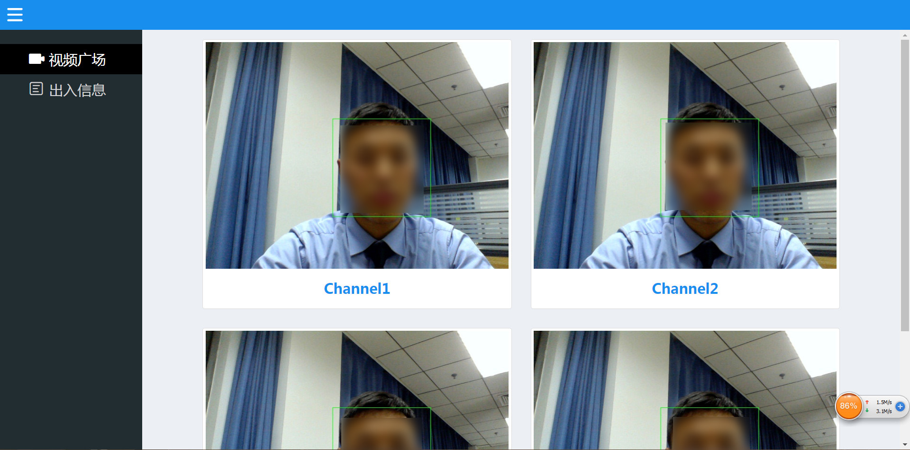
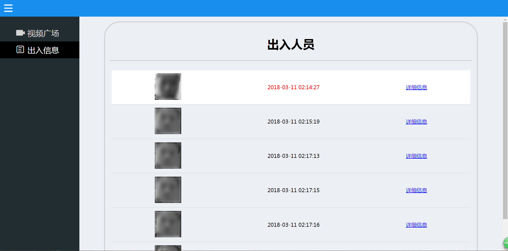

# 视频直播系统Video-system（前端部分）

一名学生党在前端之路上的艰辛奋斗历程

## 效果展示

###视频广场效果：

### 出入信息效果：

## 文档

针对本项目的开发流程，笔者总结了一套“三天”系列文档，大家可以通过下方的连接查看详情：

1.[**三天打造一款全栈简易视频直播网站（一）**](https://github.com/jerryOnlyZRJ/video-system/blob/master/docs/%E4%B8%89%E5%A4%A9%E6%89%93%E9%80%A0%E4%B8%80%E6%AC%BE%E5%85%A8%E6%A0%88%E7%AE%80%E6%98%93%E8%A7%86%E9%A2%91%E7%9B%B4%E6%92%AD%E7%BD%91%E7%AB%99%EF%BC%88%E4%B8%80%EF%BC%89.md)

2.[**三天打造一款全栈简易视频直播网站（二）**](https://github.com/jerryOnlyZRJ/video-system/blob/master/docs/%E4%B8%89%E5%A4%A9%E6%89%93%E9%80%A0%E4%B8%80%E6%AC%BE%E5%85%A8%E6%A0%88%E7%AE%80%E6%98%93%E8%A7%86%E9%A2%91%E7%9B%B4%E6%92%AD%E7%BD%91%E7%AB%99%EF%BC%88%E4%BA%8C%EF%BC%89.md)

3.[**三天打造一款全栈简易视频直播网站（三）**](https://github.com/jerryOnlyZRJ/video-system/blob/master/docs/%E4%B8%89%E5%A4%A9%E6%89%93%E9%80%A0%E4%B8%80%E6%AC%BE%E5%85%A8%E6%A0%88%E7%AE%80%E6%98%93%E8%A7%86%E9%A2%91%E7%9B%B4%E6%92%AD%E7%BD%91%E7%AB%99%EF%BC%88%E4%B8%89%EF%BC%89.md)

## 特别说明

本项目原为“人像识别社区防范系统”的前端架构部分，由于视频及图像资源涉密就未在项目中上传相关信息，大家可以clone项目参考源码，但运行相关服务会产生报错，大家可以翻看笔者撰写的文档了解笔者的编程思路

代码仅供参考，已申请法律保护，直接窃取将追究法律责任。